## 前置课程安排

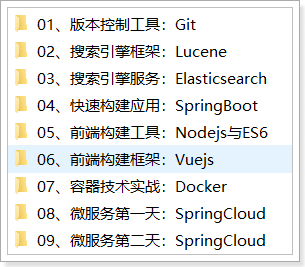 


## 今日课程目标

1、 了解git 历史 

2、 了解git 与 svn 的区别 

**3、 掌握git 的工作流程** 

4、 熟悉git 安装使用 

**5、 掌握git 管理文件版本** 

**6、 掌握使用远程仓库** 

**7、 掌握分支管理** 

**8、 掌握IDEA 操作 Git** 


## 第一部分：Git的简介与安装


### 01、版本控制是什么？

**目标：**

掌握和了解Git是什么，在实际应用中处于什么角色。

**目标**

在项目开发中，团队协作管理代码和文件是每天必须要做的事情。大家一定会碰到如下几个场景和问题？

```
1：协同修改，多人并行开发修改服务器的文件
2：数据备份
3：版本管理，权限控制
4：如果文件和工程误删了还能找回来吗？
5：分支管理 1.0 2.0
6：遇到了文件冲突如何解决？
7：如何把一些我临时保存的文件不要提交?
```

svn

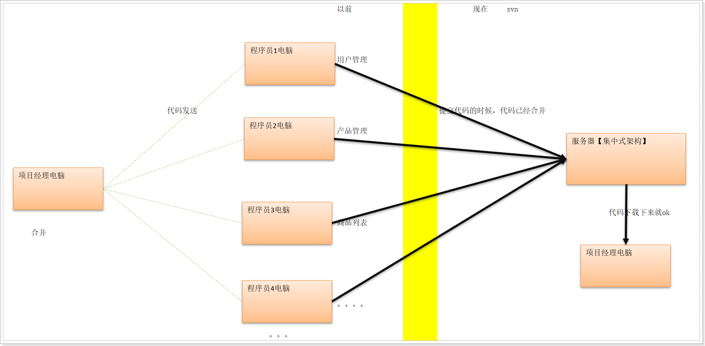 

这些问题的解决方案可以使用今天要讲的版本控制工具：Git 能够通通解决掉。


那到底什么是Git呢？

在官方明确定义：Git是一个开源，免费的**分布式**版本控制系统！


Git是目前世界上最先进的分布式版本控制系统（没有之一）。

Git有什么特点？简单来说就是：高端大气上档次！


**小结**

- svn和git都是做版本控制的，如果不理解一句话：记录代码的轨迹就好比每个人的成长阶段一样。
- 但是svn它集中式的版本控制，不能离线工作。git分布式的版本控制，它版本放在用户自己的电脑。
- svn不支持离线工作，版本全部都放在是中央服务器。如果中央服务器挂了。那么版本全部丢失。
- git支持离线工作。版本都放用户自己电脑上完成。---- 分布式的版本控制


git的模式：


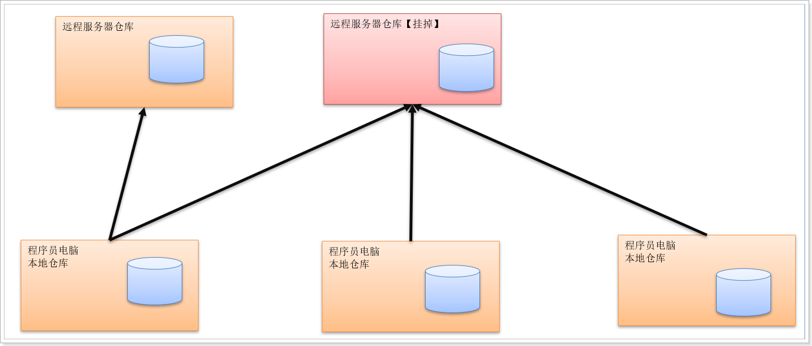 


### 02、Git的由来和发展史

**目标**：学习和掌握git的发展史及特点

**概述**

同生活中的许多伟大事件一样，Git 诞生于一个极富纷争大举创新的年代。

Linux 内核开源项目有着为数众广的参与者。绝大多数的 Linux 内核维护工作都花在了提交补丁和保存归档的繁琐事务上（1991－2002 年间）。到 2002 年，Linux 系统已经发展了十年了，代码库之大让 Linus 很难继续通过手工方式管理了，于是整个项目组开始启用分布式版本控制系统 BitKeeper 来管理和维护代码。 

到 2005 年的时候，开发 BitKeeper 的商业公司同 Linux 内核开源社区的合作关系结束，他们收回了免费使用 BitKeeper 的权力。这就迫使 Linux 开源社区（特别是 Linux 的缔造者 Linus Torvalds ）不得不吸取教训，只有开发一套属于自己的版本控制系统才不至于重蹈覆辙。他们对新的系统订了若干目标： 

```
• 速度 
• 简单的设计 
• 对非线性开发模式的强力支持（允许上千个并行开发的分支） 
• 完全分布式 
• 有能力高效管理类似 Linux 内核一样的超大规模项目（速度和数据量） 
```


Linus花了两周时间自己用C写了一个分布式版本控制系统，这就是Git！一个月之内，Linux系统的源码已经由Git管理了！牛是怎么定义的呢？大家可以体会一下。

Git迅速成为最流行的分布式版本控制系统，尤其是2008年，GitHub网站上线了，它为开源项目免费提供Git存储，无数开源项目开始迁移至GitHub，包括jQuery，PHP，Ruby等等。

历史就是这么偶然，如果不是当年BitMover公司威胁Linux社区，可能现在我们就没有免费而超级好用的Git了。

 


### 03、版本控制-集中式与分布式

**目标**：知道版本控制的分类


#### 1）集中式版本控制（Svn）

SVN是集中式版本控制系统，版本库是集中放在中央服务器的，而干活的时候，用的都是自己的电脑，所以首先要从中央服务器哪里得到最新的版本，然后干活，干完后，需要把自己做完的活推送到中央服务器。集中式版本控制系统是必须联网才能工作，如果在局域网还可以，带宽够大，速度够快，如果在互联网下，如果网速慢的话，就郁闷了。

下图就是标准的集中式版本控制工具管理方式：

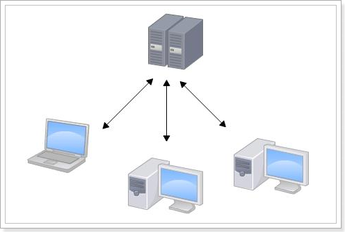 

集中管理方式在一定程度上看到其他开发人员在干什么，而管理员也可以很轻松掌握每个人的开发权限。

但是相较于其优点而言，集中式版本控制工具缺点很明显：

```
服务器单点故障
容错性差
```


#### 2）分布式版本控制（Git）

Git是分布式版本控制系统，那么它可以没有中央服务器的，每个人的电脑就是一个完整的版本库，这样，工作的时候就不需要联网了，因为版本都是在自己的电脑上。既然每个人的电脑都有一个完整的版本库，那多个人如何协作呢？比如说自己在电脑上改了文件A，其他人也在电脑上改了文件A，这时，你们两之间只需把各自的修改推送给对方，就可以互相看到对方的修改了。

下图就是分布式版本控制工具管理方式：

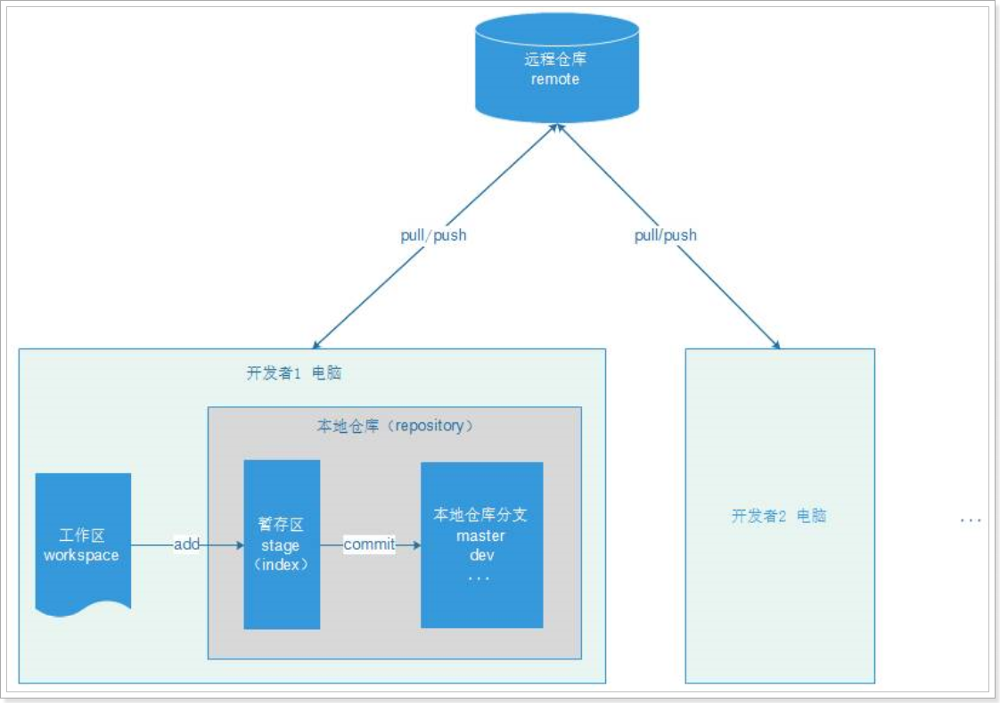 

 


### 04、Git和GitHub和码云

**目标：**掌握和了解github的基本原理和协同开发的步骤及开发流程。


比较出名的代码托管中心： GitHub 和  码云


==什么是GitHub？==

 确切的说 GitHub 是一家公司，位于旧金山，由 Chris Wanstrath, PJ Hyett 与 Tom Preston-Werner 三位开发者在2008年4月创办。这是它的 Logo：

 

2008年4月10日，GitHub正式成立，地址：How people build software · GitHub ，主要提供基于git的版本托管服务。一经上线，它的发展速度惊为天人，截止目前，GitHub 已经发展成全球最大的开源社区。

 所以 Git 只是 GitHub 上用来管理项目的一个工具而已，GitHub 的功能可远不止于此！

 


==什么是码云？==

我们使用GitHub的时候，会感觉比较慢，为什么？ 原因就是GitHub在遥远的美国，由于各种原因造成访问速度不怎么好，所以国内的git服务提供商，码云就起来了。

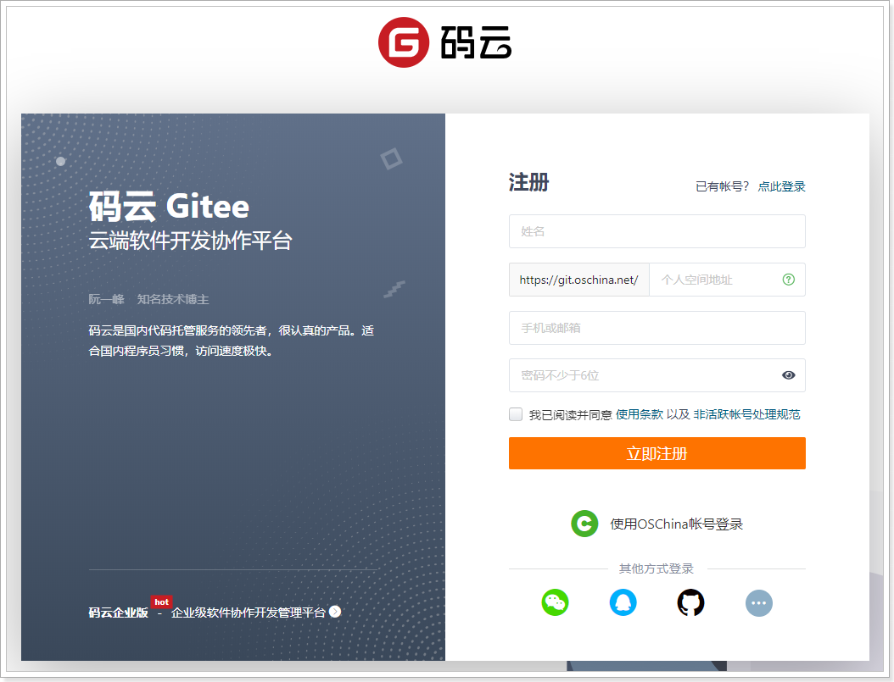 


==产品功能对比==

| 功能                    | 码云 Gitee | GitHub |
| :---------------------- | ---------- | ------ |
| 代码托管，支持 Git/SVN  | √          | √      |
| 开源项目、代码片段      | √          | √      |
| Issue                   | √          | √      |
| Wiki                    | √          | √      |
| Fork + Pull Request     | √          | √      |
| 组织                    | √          | √      |
| 私有仓库免费协作人数    | 5 人       | 3 人   |
| 保护分支                | 免费       | 收费   |
| 在线 IDE（Gitee IDE）   | √          | 不支持 |
| 仓库自动备份            | √          | 不支持 |
| 禁止 Git 强推           | √          | 不支持 |
| 支持仓库访问 IP 限制    | √          | 不支持 |
| 企业级研发协作          | 5 人免费   | 收费   |
| 敏捷开发管理            | √          |        |
| 任务看板（可灵活定义）  | √          |        |
| 支持多级任务、关联任务  | √          |        |
| 自动代码质量分析        | √          |        |
| 快捷生成工作周报        | √          |        |
| 代码克隆检测            | √          |        |
| 自动生成 JavaDoc/PHPDoc | √          |        |
| 多语言 README 自动渲染  | √          |        |
| 支持微信/钉钉通知       | √          |        |


==协作开发流程==

 


### 05、Git安装-客户端和服务端

**目标**

现在已经明白Git是一款版本控制工具。和svn一样分为客户端和服务端。

服务端用来创建仓库保存文件的版本信息。客户端用来控制服务端的文件的维护操作。


**下载**

https://git-scm.com/download

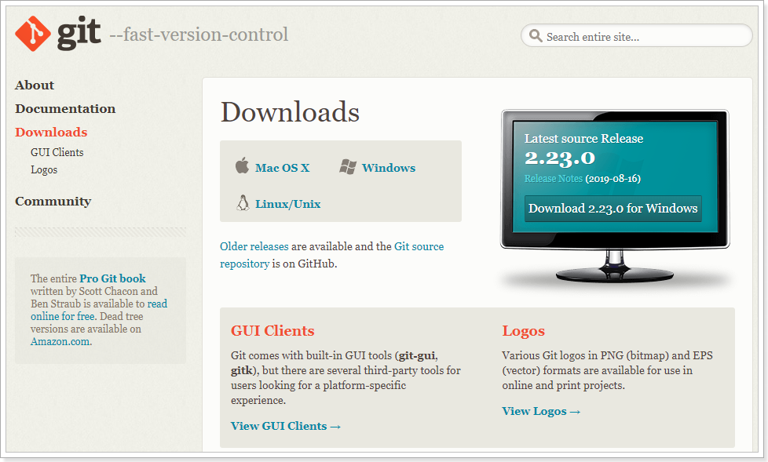 


**安装教程：安装Git服务端**

> 这是 windows 版本的 git 服务器；所以必须安装；安装说明详情见“资料”下的《Windows 系统安装 Git 2.14.1.docx》	


**==安装==**

双击安装：

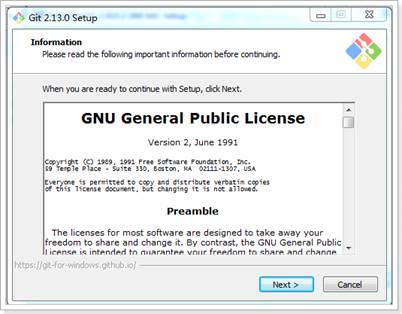 

一路“Next”使用默认选项即可。

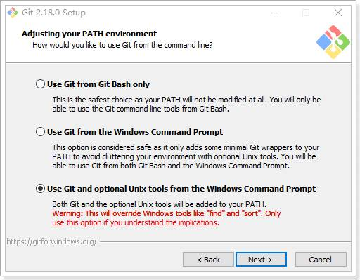 

 

安装完成后，可以在任意文件夹点右键，看到如下菜单：

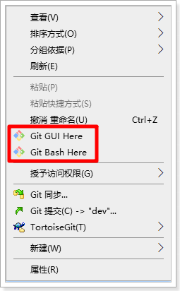  

 

点击后，出现Git的控制台，在控制台输入git，可以看到相关的帮助信息：

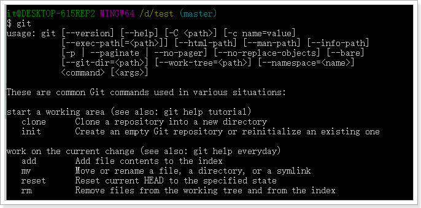  

 

初始化一个仓库： git init

==配置签名：用户名和邮箱==

git config --global user.name "nameVal"

git config --global user.email "emailVal"

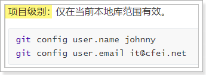  

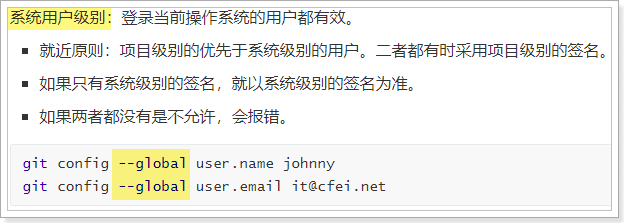 


细节：

```
局部的用户信息放在：当前项目的   .git/config
全局的用户信息放在：系统盘的--用户目录--用户名目录--.gitconfig文件中
```


## 第二部分：Git命令 入门到精通


### 06、Git操作命令-创建版本库

**目标：**知道什么是版本库，并且创建它


什么是版本库呢？版本库又名仓库，英文名repository，你可以简单理解成一个目录，这个目录里面的所有文件都可以被Git管理起来，每个文件的修改、删除，Git都能跟踪，以便任何时刻都可以追踪历史，或者在将来某个时刻可以“还原”。由于git是分布式版本管理工具，所以git在不需要联网的情况下也具有完整的版本管理能力。

创建一个版本库非常简单，

1）首先，选择一个合适的地方，创建一个空目录。我在本机的D:\\test目录下，创建了一个Hello目录： 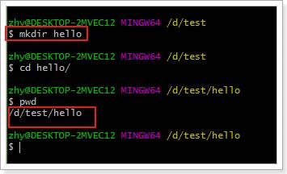

2）使用git init命令把这个目录变成Git可以管理的仓库：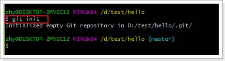

命令输入后，会提示你，已经创建了一个空的Git仓库。此时你会在hello目录下发现一个隐藏目录.git 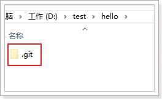

​         这个目录是Git来跟踪管理版本库的，没事千万不要手动修改这个目录里面的文件，不然改乱了，就把Git仓库给破坏了。如果你没有看到.git目录，那是因为这个目录默认是隐藏的，用ls -ah命令就可以看见。

 

​         此处的hello目录就是我们的：**工作区 (work tree)**，存放所有当前文档。此目录下的文件才会被Git管理

​         hello中的.git目录就是我们的：**本地仓库**，管理并保存所有的文档变化及历史状态。

 


==版本库核心文件的解释==

|  目录   | 描述                                                         |
| :-----: | :----------------------------------------------------------- |
| config  | 该文件主要记录针对该项目的一些配置信息，例如是否以bare方式初始化、remote的信息等，通过git remote add命令增加的远程分支的信息就保存在这里； |
| objects | Git中的文件和一些操作都会以git对象来保存，git对象分为BLOB、tree和commit三种类型，例如git commit便是git中的commit对象，而各个版本之间是通过**版本树**来组织的，比如当前的HEAD会指向某个commit对象，而该commit对象又会指向几个BLOB对象或者tree对象。 |
|  HEAD   | 该文件指明了git branch（即当前分支）的结果，比如当前分支是master，则该文件就会指向master，但是并不是存储一个master字符串，而是分支在refs中的表示，例如ref: refs/heads/master |
|  index  | 该文件保存了暂存区域的信息。该文件某种程度就是缓冲区（staging area），内容包括它指向的文件的时间戳、文件名、sha1值等； |
|  Refs   | 该文件夹存储指向数据（分支）的提交对象的指针。               |


**小结**

```
创建版本库的步骤：
1）  进入需要管理的目录
2）  执行 git init 命令
```


### 07、Git操作命令-添加文件并提交

**目标：**Git是如何在仓库中添加文件，代码或者工程的呢？


版本控制系统，其目的就是跟踪文本文件的改动，例如我们开发时编写的.java、.xml、.properties本质都是文本文件。文件中每一个字符的变化都会被跟踪并且管理。


**图解：**

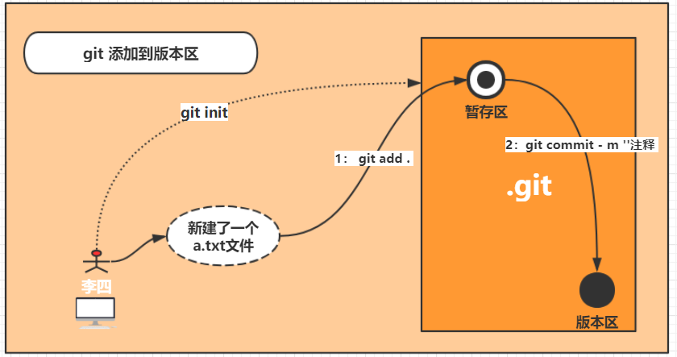

**缩略图：**

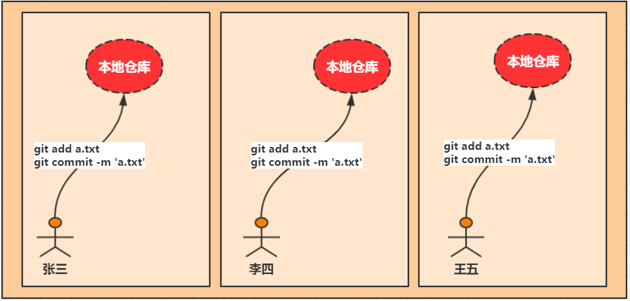


1）我们在当前的hello目录下创建一个新的文本文件：readme.txt

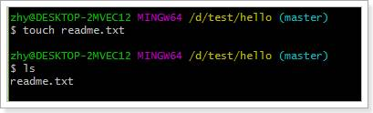 

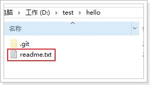 

编写一段文字（注意，一定不要用windows的记事本）：hello Git!

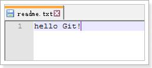 

 

2）接下来，我们使用 git add 命令，将文件添加到暂存区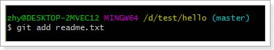

没有任何的反应，证明没有问题


3）使用 git commit 命令，将暂存区文件提交到本地仓库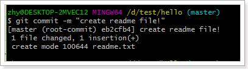

命令解释：

​         git commit 命令可以将暂存区的文件提交到版本库。

​         -m 参数，是本次提交的说明信息，用来注释本次提交做了些说明事情。

 

**总结**，将一个文件添加到本地仓库，分两步：

3）  使用 git add <file> 命令，添加文件。可以一次添加多个文件。

4）  使用 git commit 命令，提交，一次即可。

 

可能大家会有疑问，为什么这里不是直接commit提交，而是要经过add和commit两个步骤呢？

 

这就关系到Git的版本库中的 工作区 暂存区概念了。


### 08、Git操作命令-工作区、暂存区、版本库

**目标：**理解Git 工作区、暂存区和版本库概念


==**工作区：**==

工作区就是你在电脑里能看到的目录。比如我们刚刚创建的hello目录：

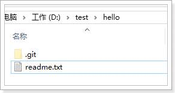 

其中包含了一个隐藏目录 .git ，其它就是我们需要被管理的文件。


==**版本库及暂存区：**==

工作区有一个隐藏目录.git，这个不算工作区，而是Git的版本库。

 

Git的版本库里存了很多东西，其中最重要的就是称为stage（或者叫index）的暂存区，还有Git为我们自动创建的第一个分支master，以及指向master的一个指针叫HEAD。

​         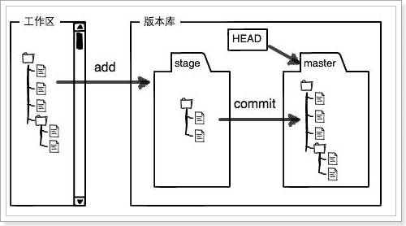 

前面讲了我们把文件往Git版本库里添加的时候，是分两步执行的：

 ```
第一步是用git add把文件添加进去，实际上就是把文件修改添加到暂存区；
第二步是用git commit提交更改，实际上就是把暂存区的所有内容提交到当前分支。
 ```


因为我们创建Git版本库时，Git自动为我们创建了唯一一个master分支，所以，现在，git commit就是往master分支上提交更改。

 


**小结：**你可以简单理解为，需要提交的文件修改通通放到暂存区，然后，一次性提交暂存区的所有修改。


### 09、Git操作命令-文件的修改、状态、日志

**目标：**掌握文件的修改以及修改的提交及状态日志的查看


被版本库管理的文件不可避免的要发生修改，此时只需要直接对文件修改即可。修改完毕后需要将文件的修改提交到版本库。


我们对readme.txt文件进行修改，添加一行数据：

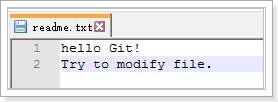 


==比较差异：==

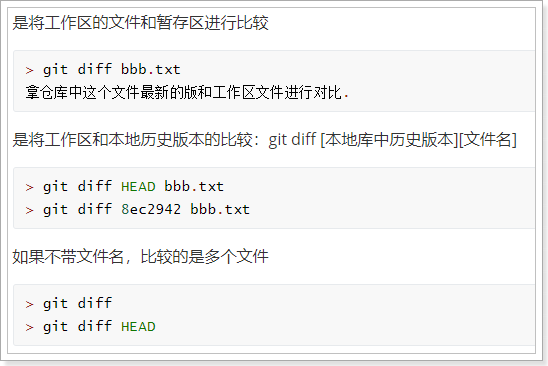 

用`git diff HEAD -- readme.txt`命令可以查看工作区和版本库里面最新版本的区别：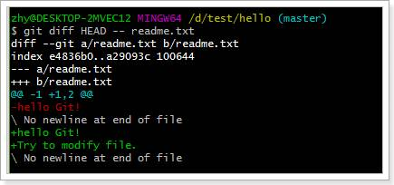

可以发现，与版本库中的 readme.txt相比，我们多了一行文本！


==查看状态，提交修改：==

我们如果不确定自己的哪些文件被修改了，可以使用git status 命令，查看当前工作区的状态：

  

可以清楚的看到：changes not staged for commit（修改没有被缓存，需要使用git add来进行添加操作）

 

我们使用git add 命令，添加到暂存区：

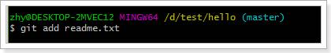 

再次查看状态：

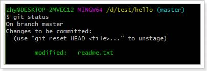 

这次提示： changes to be commited （修改需要被提交），我们使用git commit 进行提交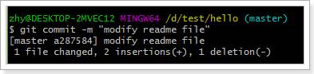

再次查看状态：

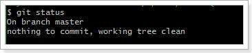 

提示说：工作区很干净，没有任何需要提交，搞定！

 

 

==查看日志==

```java
 git log  整体展示，不直观，如果要翻页，一直按enter键进行翻页，按CTRL+C退出
```

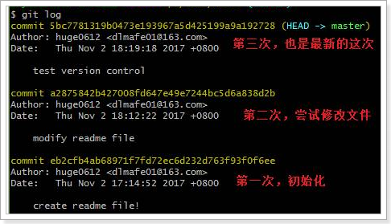 

如果嫌输出信息太多，看得眼花缭乱的，可以试试加上`--pretty=oneline`参数：

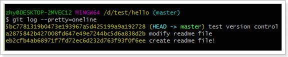 

 

可以发现，目前为止，我们已经在本地仓库中提交了3次，也就是说有3个不同版本。其中，最近的这个版本有一个标示：HEAD ，这就是标记当前分支的当前版本所在位置。本例当中，当前版本即 test version control这次提交。

另外，在log中，每一个版本的前面，都有一长串随即数字：5bc7781319b…192728 ，这是每次提交的commit id ，这是通过SHA1算法得到的值，Git通过这个唯一的id来区分每次提交。


美化的缩小版

```
 git log --oneline
```

 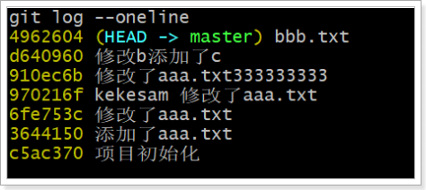 


### 10、Git操作命令-版本回退

**目标：**使用git命令git reset 找回文件回退到历史版本


==版本回退==

现在，假设我们要回到上一级版本，该如何操作呢？

 

首先，Git通过HEAD来判断当前所在的版本位置。那么上一个版本，就用HEAD^标示，上上一个版本就是HEAD^^，当然往上100个版本写100个^比较容易数不过来，所以写成HEAD~100。

 如果要从 “test version control” 回退到 “modify readme file” ，我们可以使用 git reset 命令

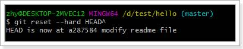 

 提示说：HEAD 现在已经被设置到 a287584 的版本，即 modify readme file。


我们查看readme.txt： 

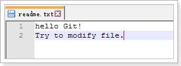 

果然，版本已经回退了，最新添加的数据“Test version control”已经没了。

 此时再次查看日志，发现只剩下2次提交信息了，第三次提交的信息已经没了：

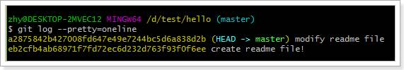 

 假如此时我后悔了，还想回到第3次提交的版本，怎么办？


==查看所有关联日志并回退到某个版本==

我们可以通过git reflog命令，看到以前的每次执行动作： 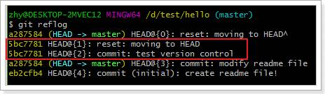

其中红框内的部分，就是我们第三次提交的日志信息。前面的5bc7781 就是第三次提交的 commit id 的前几位数字。

 

我们可以通过指定commit id 的方式，来指定HEAD的位置：

指令：git reset --hard {commit id}

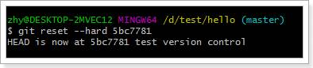 

查看日志： 

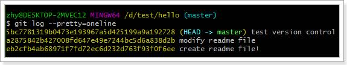 

 查看文件：

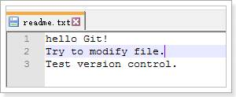 

 数据又回来了！


**总结：**

如果要进行版本回退或前进，一般分两步：

1）  通过git log 或 git reflog 查看操作日志吗，查找版本的commit id

2）  通过 git reset --hard <commit id> 设置HEAD到指定版本

 

其实版本的回退，仅仅是修改HEAD指针的位置而已，因此Git进行版本的切换，比svn要快的多！


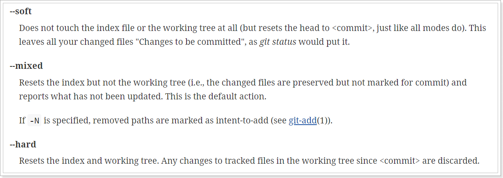 

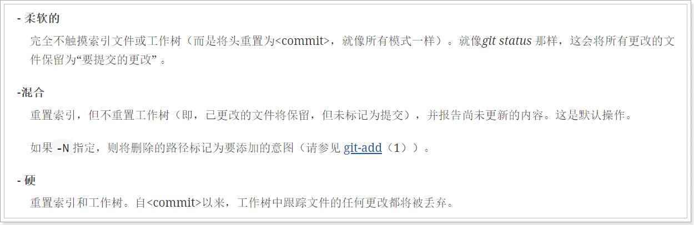 


### 11、Git操作命令-撤销修改

**目标：**掌握文件修改的撤销


#### 1）撤销工作区修改

现在我们在readme.txt中添加一行数据：

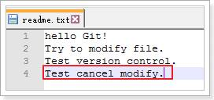 

在你提交前，你突然发现这个修改是有问题的，你打算恢复到原来的样子。怎么办？

如果修改的并不多，我们完全可以手动恢复到原始状态。但是如果改动比较大，手动处理就很容易有遗漏，而且很麻烦。怎么办？

 

查看状态：

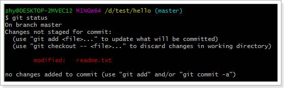 

 

Git提示我们，现在文件已经修改，等待被staged（暂存）。我们有两个选择：

1）  可以使用git add 来添加到暂存区，接着去提交文件

2）  可以使git checkout -- <file> 来撤销修改

 

所以，这里我们选择第二种方案：

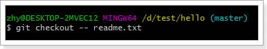 

再次查看状态：

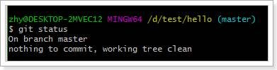 

工作区是干净的！

查看文件：

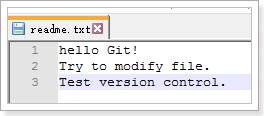 

修改已经被撤销了！

 


#### 2）撤销staged（暂存区）修改

 

刚才的案例中，我们修改了数据，并没有add带暂存区，处理起来还算简单。

如果我们已经吧数据add 到了暂存区，又该如何处理呢？

 我们首先添加一行数据到readme.txt

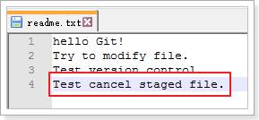 

并且添加到staged（暂存区），然后查看状态

 

 

有一个修改等待被提交，并且有一行提示：

 

可以使用 git reset HEAD <file> 来撤销缓存修改。

 

我们前面说过，git reset 命令可以进行版本回退，此处reset 指定的是HEAD ，而不是其他版本，因此就有撤销缓存修改的作用：

 

查看状态：

 

 

发现文件的修改被撤回到了工作区，尚未添加到staged（暂存区），我们再次执行git checkout -- <file> 即可撤销工作区修改

 

工作区干净了！

查看文件：

 

文件也恢复了原来的状态，整个世界都清净了！


**总结：**

撤销修改分两种情况：

1）  撤销工作区修改，使用git checkout -- <file>

2）  撤销暂存区修改，分两步：

​			a) 使用git reset HEAD <file>来撤销暂存区修改。

​			b) 使用git checkout -- <file>来撤销工作区修改

 


### 12、Git操作命令-忽略不需要提交的文件

**目标**

往往在开发的过程中，特别是在多人协作的场景下，可能需要把一些无用的文件不需要提交。GIT是如何来做的的呢？


**图解**

&nbsp;

**方式：**

创建.gitignore 或者TortoiseGit软件进行添加

 

**创建命令**

```ruby
# 1:打开`git bash here` 输入如下命令：
> vim .gitignore
target
*.iml
.idea
#2:保存退出 
:wq

```

gitignore 语法规则

> 空行或是以 # 开头的行即==注释行==，将会被忽略。 
>
> 可以在前面添加正斜杠 / 忽略当前路径文件，但不包括子目录的同名文件。 
>
> 可以在后面添加正斜杠 / 来忽略文件夹。 
>
> 可以使用 ! 来否定忽略，即比如在前面用了 *.apk ，然后使用 !a.apk ，则这个 a.apk 不会被忽略。 
>
> \* 用来匹配零个或多个字符，如 *.[oa] 忽略所有以".o"或".a"结尾， *~ 忽略所有以 ~ 结尾的文件（这种文件通常被许多编辑器标记为临时文件）； [] 用来匹配括号内的任一字符，如 [abc] ，也可以在括号内加连接符，如 [0-9] 匹配 0 至
>
> 9 的数； ? 用来匹配单个字符。  
>
> 
>
> 示例如下： 
>
> \# 忽略 .a 文件 
>
> *.a 
>
> *.txt
>
> \# 但不忽略 lib.a, 尽管已经在前面忽略了 .a 文件 
>
> !lib.a 
>
> \# 仅在忽略当前目录下的 TODO 文件， 但不包括当前目录的子目录下的 subdir/TODO 
>
> /TODO 
>
> \# 忽略 build/ 文件夹下的所有文件 build/ 
>
> \# 忽略 doc/notes.txt, 不包括 doc/server/arch.txt doc/*.txt 
>
> \# 忽略所有的 .pdf 文件 在 doc/ directory 下的 doc/**/*.pdf 


## 第三部分：Git的远程仓库


### 13、远程仓库-注册、创建仓库、提交文件

**目标**

之前我们讲的文件版本控制都是在本机的本地仓库中进行操作，如何进行团队协作开发，怎么把我们本地仓库的代码共享出来供团队的其他开发员下载使用呢？

没错就是：远程仓库。


==远程仓库：==

到目前为止，我们已经学会了如何在本机利用git进行文件版本管理，但是如果要想进行多人协作，我们就必须使用远程仓库。将本地仓库的数据同步到远程仓库，实现多人协作开发。

1）目前比较热门的代码托管社区：GitHub，网址：https://gtihub.com  ,提供了免费的远程git仓库功能。不过网速不是特别流畅。

2）在国内，有很多的公司使用oschina提供的git服务：码云, https://gitee.com ，

3）也可以自己搭建：gitlab、gogs


&nbsp;

**==注册==**

1：登录github的官网

注册地址：<https://github.com/join?source=login>

&nbsp;

2：创建远程仓库

&nbsp;


&nbsp;

比如：

&nbsp;

3：详细介绍远程仓库

&nbsp;


码云注册


**==创建新的仓库==**

在页面左侧，选择创建新的仓库

 

填写仓库信息：

 

仓库创建完毕，可以看到，如果我们要与远程仓库同步，这里支持两种不同的通信协议，ssh和http。当我们选中一种协议后，后面会出现对应的远程仓库地址。

 


==**关联远程仓库**==


&nbsp;

**步骤**

**格式：**

> git remote rm origin  从当前数据库中删除现有的关联
>
> git remote add origin  xxxx的远程仓库地址 https


1：配置账号和密码

```java
> git config --global user.name "xiaofeifei"
> git config --global user.email "xiaofeifei@qq.com"
```

2：添加本地仓库和远程仓库关联-https连接

```ruby
> git remote add origin https://github.com/xiaofeifei/gitdemo.git

如果删除之前关联：
> git remote rm origin
> git remote add origin 改成新的地址
```

初次关联使用提交代码的时候需要填写，账号和密码信息。

3：添加本地仓库和远程仓库关联-ssh连接（免密)

```ruby
> git remote add origin git@github.com:xiaofeifei/gitdemo.git
```


提交到远程仓库的命令是：

> git push origin master 

注：origin 可以理解为远程的数据库，master理解为表,真正的含义是：分支。


**小结**

1：git remote 以后地址记录什么地方呢？


### 14、远程仓库-克隆远程仓库到本机 

**目标**

如何克隆远程仓库到本机呢？

图解

&nbsp;

步骤

> git clone ssh/https 
>
> git push  origin master
>
> git pull origin master

 


**小结**

git clone 初次拉取代码。


### 15、远程仓库-更新到本机

**目标：**

如何同步远程仓库的代码到本地仓库到呢？

**图解**


**步骤：**

```ruby
git pull origin master
```

 

==如果出现如下问题==

```
 ! [rejected]        master -> master (fetch first)
error: failed to push some refs to 'https://gitee.com/kekesam/pingyougou2.git'
hint: Updates were rejected because the remote contains work that you do
hint: not have locally. This is usually caused by another repository pushing
hint: to the same ref. You may want to first integrate the remote changes
hint: (e.g., 'git pull ...') before pushing again.
hint: See the 'Note about fast-forwards' in 'git push --help' for details.
```

解决方案1：

```ruby
git push -f origin master
```

它会把远程仓库中所有的信息全部清空，在把本机仓库版本提交上去，

解决方案2：

```
git clone https://gitee.com/kekesam/pingyou3.git
然后在去放代码和工程。然后在
git add .
git commit -m 'xx'
git push origin master
```


### 16、远程仓库-SSH-协议免密操作配置和注意事项

**目标**：掌握ssh协议免密的配置


连接远程仓库，势必会进行其用户验证，这个时候需要频繁的输入用户的账号信息，有没有一种能够免密的操作呢？为什么我们连接好以后就不需要配置用户名和密码了呢？因为windows10系统会帮我们记录用户的凭据信息可以在【控制面板】---凭据管理中获得。

 

但是很遗憾的是：在window7系统中没有这种凭据，https的这种方式可能就会出现一个现象就是频繁的数据用户名和密码，这样就是一件繁琐的操作，如何解决呢？没错使用ssh的方式来进行连接。


SSH架构：  Struts2+Spring+Hibernate


==什么是SSH协议==

```
SSH是英文Secure Shell的简写形式。通过使用SSH，你可以把所有传输的数据进行加密，这样"中间人"这种攻击方式就不可能实现了，而且也能够防止DNS欺骗和IP欺骗。

使用SSH，还有一个额外的好处就是传输的数据是经过压缩的，所以可以加快传输的速度。SSH有很多功能，它既可以代替Telnet，又可以为FTP、Pop、甚至为PPP提供一个安全的"通道"。

如果一个用户从本地计算机，使用SSH协议登录另一台远程计算机，我们就可以认为，这种登录是安全的，即使被中途截获，密码也不会泄露。

最早的时候，互联网通信都是明文通信，一旦被截获，内容就暴露无疑。1995年，芬兰学者Tatu Ylonen设计了SSH协议，将登录信息全部加密，成为互联网安全的一个基本解决方案，迅速在全世界获得推广，目前已经成为Linux系统的标准配置。
```


==创建SSH密钥==

Git-bash中已经集成了ssh功能，所以我们只需要简单的命令，即可生成密钥：ssh-keygen -t rsa

一路回车向下走，不要输入任何内容即可！

ssh-keygen -t rsa        一路三个回车

 

执行命令完成后,在window本地用户.ssh目录C:\Users\用户名\.ssh下面生成如下名称的公钥和私钥:

 


**图解**

&nbsp;

具体步骤如下：

第一步：打开命令工具"git bash here" 输入命令 “**ssh-keygen -t rsa** ” 生成密钥和公钥

```ruby
ssh-keygen -t rsa
ssh-keygen -t rsa -C xiaofeifei@qq.com

```

第二步：然后点击【New SSH keys】 按钮，将【C:\Users\mengk\.ssh】生成的公钥文件【id_rsa.pub】内容复制出来.

第三步：打开github官网--【登录】--【settings】-【SSH-GPG keys】选项如下图：

> 

第四步：测试和体验ssh的免密操作

1：添加远程仓库和本地仓库的关联：<span style="color:red">(origin 是默认的远程版本库名称)</span>

```java
> git remote add origin git@github.com:xiaofeifei/gitdemo.git
```

<span style="color:red">提示：如果你想更换远程仓库的地址：</span>

```java
> git remote rm origin     #删除原来的origin
  
# 然后在执行
> git remote add origin 你需要更换的远程仓库地址
```

2：提交代码到远程仓库中：

```java
> git push origin master
```

4：拉取最新代码到本机

```
> git pull origin master
```


**小结**

==注意：记得将https地址更换ssh地址。==


### 17、分支管理-合并分支,切换分支

**目标：**

分支在实际中有什么用呢？假设你准备开发一个新功能，但是需要两周才能完成，第一周你写了50%的代码，如果立刻提交，由于代码还没写完，不完整的代码库会导致别人不能干活了。如果等代码全部写完再一次提交，又存在丢失每天进度的巨大风险。

 

文件提交的过程 

&nbsp;

图解：


第四步：合并分支

图解：

&nbsp;命令的方式：

第一步：创建分支

```java
> git branch dev   创建分支 dev
> git checkout dev  选中当前分支  dev

注：上面两个命令可以组合成一个复合命令
> git checkout -b dev 
git checkout -b dev  =  （git branch dev +  git checkout dev）

```

第二步：查看分支

```java
> git branch

```

第三步：添加文件，提交文件在当前分支

```java
> vim e.txt  --- 创建文件，输入任意内容
> git add . ---提交e.txt文件，
> git commit -m 'e.txt' 提交e.txt文件到test分支中

```

第四步：推送分支到远程仓库中

```java
> git push origin dev

```

第五步：合并分支

```java
> git checkout master --切换回master分支
> git merge dev --- 将dev下面的内容全部合并到master中

```

第六步：删除分支

```java
> git branch -d dev	

```


## 第四部分： 客户端工具操作（TortoiseGit）


### 18、客户端小乌龟-安装与中文包

目标： 掌握客户端的安装


安装步骤：

 

一路“Next”使用默认选项即可。

默认选项下会启动配置画面：

 

由于目前只有英文语言包，默认即可继续下一步。

配置git.exe，在4.2.1中已经安装过git-for-windows了所以在此找到git.exe所在的目录。

 

 

配置开发者姓名及邮箱，每次提交代码时都会把此信息包含到提交的信息中。

 

使用默认配置，点击“完成”按钮完成配置。

 

完整完毕后在系统右键菜单中会出现git的菜单项。

 


==安装中文包==

安装中文语言包并不是必选项。可以根据个人情况来选择安装。

  

 

直接“下一步”完整完毕。

 

鼠标右键选择Settings

 

 

 

语言包安装完毕后可以在TortoiseGit的设置中调整语言

 

 


### 19、客户端小乌龟-基本使用

#### 1）创建本地仓库

我们新建一个空的文件夹：

 

然后进入tortoise目录，右键操作：

 

弹出提示，不要勾选：

 

查看目录，发现生成.git文件夹：

 

 

#### 2）添加文件并提交

创建新的文件：

 

编写内容：

 

在文件夹中右键操作：


提示：这一步等同于我们的 git add readme.txt

​         

 

此时直接点击提交，即可完成：git commit 操作：

​         

提示：

​         

 

#### 3）差异对比

修改readme.txt：

​         

右键操作：

​         

结果：

​         

#### 4）提交修改

直接在文件上选择右键，提交即可：


#### 5）查看提交日志

 

选中文件，右键菜单中，选中查看日志：

​         

提交的日志信息：

  

#### 6）版本回退

 

现在我们再次修改readme.txt，并且提交

​         

查看日志：

​         

 

假如我们要回到上一个版本，也就是第2次提交。

 

我们选中第2次提交，然后右键，选中：重置“master”到这个版本

​         

弹出菜单，这里选中Hard模式，然后确定：

​         

再次查看日志，只剩下第1和第2次提交了。并且HEAD已经设置到了第2次提交位置

​         

文件也回滚了：

​         

如果我现在后悔了，想再次回到第3次提交怎么办？现在连日志都没有了！

 

此时，在空白处点击右键，选中 显示引用记录：

​         

弹出所有操作的日志信息：

​         

现在，我们找到第3次提交，右键，选中：重置“master”到这个版本

​         

结果，第3次提交又回来了！

​         

文件内容回来了：

​         

 

#### 7）撤销修改

 

我们现在修改文件：

​         

现在后悔了，想要还原到修改以前。

 

我们可以选中文件，右键。然后选中菜单：还原。

​         

点击确定：

​         

 

还原成功：

​         

查看文件：

​         

 


## 第五部分：Idea操作Git


### 20、Idea操作Git-Idea中配置Git


在Idea中配置Git

 

打开File菜单：

**在File --> Setting->Version Control --> Git -->Path to Git executable选择你的git安装后的git.exe文件**

**打开Settring:**

**==方式一：==**

 

**==方式二：==**

 


配置本地安装的Git的git.ext文件：

 

测试是否成功：

 


### 21、Idea操作Git-创建工程

我们新建一个maven工程：

 

 

 

编写简单的代码：

​         

 

### 22、Idea操作Git-将项目创建为本地仓库

 

**创建本地仓库**

  

**打开****VCS****菜单：**

**VCS  -->  Import into Version Control --> Create Git Repository****：**


 

 

在弹框中选中项目所在的位置，**点击****OK**。

此时项目文件全部变成**棕色**。


 

 

**项目工程目录**：

项目Git版本已经创建成功。

​         

 

### 23、Idea操作Git-忽略文件

这里可以手动修改.gitignore文件，也可以通过插件过滤。我们手动修改：

 

 

  

 

.gitignore

```
#官方忽略
# Compiled class file
*.class

# Log file
*.log

# BlueJ files
*.ctxt

# Mobile Tools for Java (J2ME)
.mtj.tmp/

# Package Files #
*.jar
*.war
*.nar
*.ear
*.zip
*.tar.gz
*.rar

# virtual machine crash logs, see http://www.java.com/en/download/help/error_hotspot.xml
hs_err_pid*

#新增
.classpath
.project
.settings
target

#idea
*.iml
.idea
```


### 24、Idea操作Git-提交代码

 

#### 1）添加到暂存区

 

**添加项目到本地仓库暂存区：**

 

项目右键选择Git --> add

此时项目文件变成绿色，此时文件只是处于暂存区，并没有真正进入到版本库中。


 

 

此时项目文件全部变成**绿色**。


 

 

 

#### 2）提交

 

**提交项目到本地仓库：**

 

项目右键Git--> Commit Directory

在弹窗中输入Commit Message，点击commit，此时项目文件从暂存区真正进入版本库中，项目文件变成**黑色**。


 

 

编辑本次提交备注信息，然后点击commit按钮。


 

 

 

此时项目文件全部变成**黑色**：

​          

 

 

### 25、Idea操作Git-提交远程仓库

 

#### 1）新建一个远程仓库

 

在远程仓库创建新项目：

 

 

记录地址：

 

 

#### 2）推送到远程仓库

右键菜单—> **Git -****à** **Repository -****à** **Push** ，然后填写远程仓库地址。

 

 

复制远程仓库的地址，并填写：

 

 

选择远程分支的名称，点击Push：


 

推送成功：

 在Idea右下角弹出提示框

​         

 

查看远程仓库，推送成功。

 

 

#### 3）拉取数据

 

在远程仓库随意修改代码：

 

 

在项目中，拉取代码：

 

 

点击Pull：

​         

 

代码成功同步：

​         

 

 

 

 

### 26、Idea操作Git-克隆项目

#### 1）删除本地项目

断开联接

**打开Settings…**：

​         

 

断开idea与Git版本仓库的联接：


 

 

从Idea和本地文件目录中删除项目。

 

 

#### 2）克隆远程仓库并导入Idea

 

**打开Idea:**

点击 **Check out form Version Control**，选中Git


 

**填入远程仓库SSH****地址**：

输入你的远程仓库地址，点击Test，测试一下地址是否正确。

点击Clone


 

 

**点击YES****：**

Clone出远程仓储的工程，并且导入到idea中。


 

 

**导入成功：**


 

 

右键Git，可以与远程仓库进行push和pull代码操作了。


 

 

 

### 27、Idea操作Git-解决冲突

#### 1）制造冲突：

我们创建新的分支dev，并且在dev修改提交代码。

 

然后在master修改提交代码。

 

 

接下来尝试合并dev分支：

 

 

 

选择要合并的分支：

 

 

  **发现合并失败：**

此时文件有**红色标记**


 

 

 

#### 2）解决冲突：

使用右键，菜单工具：**Resolve Confilcts…**

 


 

 

**点击Merge****合并策略:**

Accept Yours：保留你自己的代码, 

Accept Theirs：保留别人的,

merge：人工合并 (人工把需要的代码复制粘贴到结果集result里面比较保险)


 

**弹出一个对比页面**：

在Result中，手动合并完成后，点击Apply按钮，完成冲突代码合并。


 

 

**此时文件的红色标记没了**：

 

但是有未提交的**蓝色标记**。

 

然后提交，文件变为**黑色**。冲突被解决！

 

 

 

 

 


 


### 28、课程总结

 


